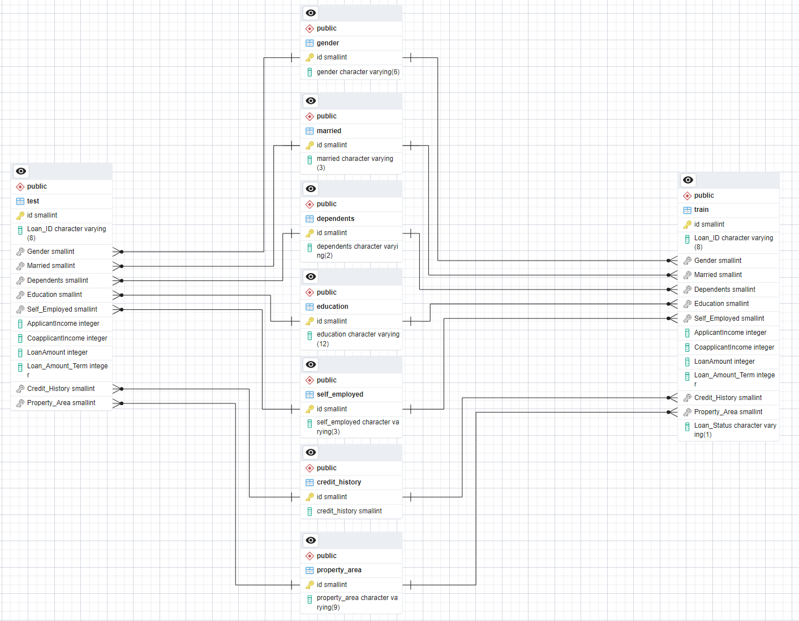

### Portfolio project
# Data Warehousing & Containerization Project

This is repository for Turing College Data Engineering course Module 3 Sprint 1 Part 5 - **Data Warehousing & Containerization Project** by Jakub Kluz.

The purpose of this project is to practice managing Docker containers from Airflow environment. I will create a PostgreSQL container, download, transform and load the data to the database with a custom Python container from Apache Airflow. I will also build the custom Python container, that will contain the Python code that will perform the project objectives.

## Environment
I am developing on GNU/Linux Ubuntu 22.04 Server Edition using Oracle Free Tier ARM64 machine VM.Standard.A1.Flex with 4 ARM cores and 24 GB of RAM. The machine is working beautifuly for me for the whole Turing College course.

* Apache Airflow 2.7.3 from Docker Hub, image `apache/airflow:2.7.3` and [customized script](docker/docker-compose.yaml) based on the [Apache Airflow Docker Compose Guide](https://airflow.apache.org/docs/apache-airflow/stable/howto/docker-compose/index.html).
* Docker 24.05 from the Ubuntu repository along with Docker Compose 1.29.2 as a plugin (not yet integrated into Docker - it happened in the following versions).
* Python 3.12 from Docker Hub, image `python:3.12-slim`
* PostgreSQL 16.1 from Docker Hub, image `postgres:16.1`
* Adminer 4.8.1 from Docker Hub, image `adminer:4.8.1`
* Pandas 2.1.3

I am developing with Visual Studio Code with Remote SSH connection to the Oracle machine.

### Docker connection
I need to have access to Docker Engine from within Airflow environment to be able to manage Docker containers. For sake of simplicity I decided to stick to the solution enabled in Docker by default, which is a Unix-type socket at `/var/run/docker.sock`. In order to make it work, I need to expose this file into the Airflow environment. I have decided to enable it in [docker-compose file](docker/airflow/docker-compose.yaml) at line 77. This is inspired by the [Portainer install guide](https://docs.portainer.io/start/install-ce/server/docker/linux).n

### Airflow Docker Compose stack
The official Docker Compose [stack definition](https://airflow.apache.org/docs/apache-airflow/stable/howto/docker-compose/index.html) in the form of `docker-compose.yaml` need some alteration to run this project. You can find the exact file I used [here](docker/airflow/docker-compose.yaml).

There are some aspects you need to take into consideration:
* Line 78: I am mounting the `dags` folder from this repository to the `/opt/airflow/dags` folder within a container, where Apache Airflow looks for DAG files.

## ETL process
The ETL process is defined in a single DAG, that is located [here](dags/etl.py). It has several tasks, that are responsible for different areas. Let's break them down.

### Creating the PostgreSQL database server container
I am creating the PostgreSQL database server container with `BashOperator` that invokes `docker run` commands with PostgreSQL and Adminer for administration. The bash script is stored [here](dags/scripts/create_database.sh). I initialy tried to run it with `DockerOperator`, but it doesn't seem to present an option to detach the container, so the task will never finish - that might be handy for monitoring purposes, but I don't consider Airflow a right tool + I will never be able to run the tasks that follow. Then I create user and database with `PostgresOperator` and simple SQL statement, templated with two Airflow Connections:
* `jakluz-de3.1.5-postgres` - the Connection, that stores login data for the administrative `postgres` user
* `jakluz-de3.1.5-postgres-turing` - stores the login data for the `turing` user

### Preconfigure database
I am creating user `turing` for the scope of this project along with a separate database with `PostgresOperator` and administrative `postgres` user. Then I estabilish tables, constraints and relations from the [SQL file](dags/sql/create_db_schema.sql) with the `turing`. The schema looks like this:

### Fetch the data from Kaggle
I am using my [own Docker image](https://hub.docker.com/r/jkluz/jakluz-de3.1.5/tags) to fetch data. It is built with a [`Dockerfile`](docker/etl/Dockerfile) and utilizes a  Python [script](docker/etl/download_data.py), that uses the [Kaggle Python package](https://pypi.org/project/kaggle/) to download the [dataset](https://www.kaggle.com/datasets/vikasukani/loan-eligible-dataset). The package provides its own authentication mechanizm, that can utilize environment variables `KAGGLE_USERNAME` and `KAGGLE_KEY`, which I provide to the Docker container through `DockerOperator` using the following Airflow Connection data:
* `jakluz-de3.1.5-kaggle` - a HTTP Connection, that stores Kaggle credentials

### Transform and load the data
The transformation is performed with the same [Docker image](https://hub.docker.com/r/jkluz/jakluz-de3.1.5/tags), but invoking [another Python script](docker/etl/transform_and_load_data.py), that does the heavy lifting. The transformation process is basend on Pandas dataframes. I am pretty happy with the process and environment variables validation that I came up with.

## Possible improvements with considerations
1. Replace Docker authentication from socket file to API call. That is not exactly better solution, but I don't really like the idea of exposing socket file to container much. It is working though.
2. The Airflow Connections does not really feel portable to me. Probably it would be much better to stick to `.env` files, that would store the connection information. It would make the user start the project much quicker. However, they would still need to alter `.env.sample` files, but that would be faster, than adding a Connection. It would probably also be more in line with the programatic approach, that is the clue of this project. It mostly boils down to the project exact use case - for the longer project with a dedicated team Connections approach would be better, while for an Open Source project, where users would clone the repo and follow the instructions, the `.env` approach might be better.